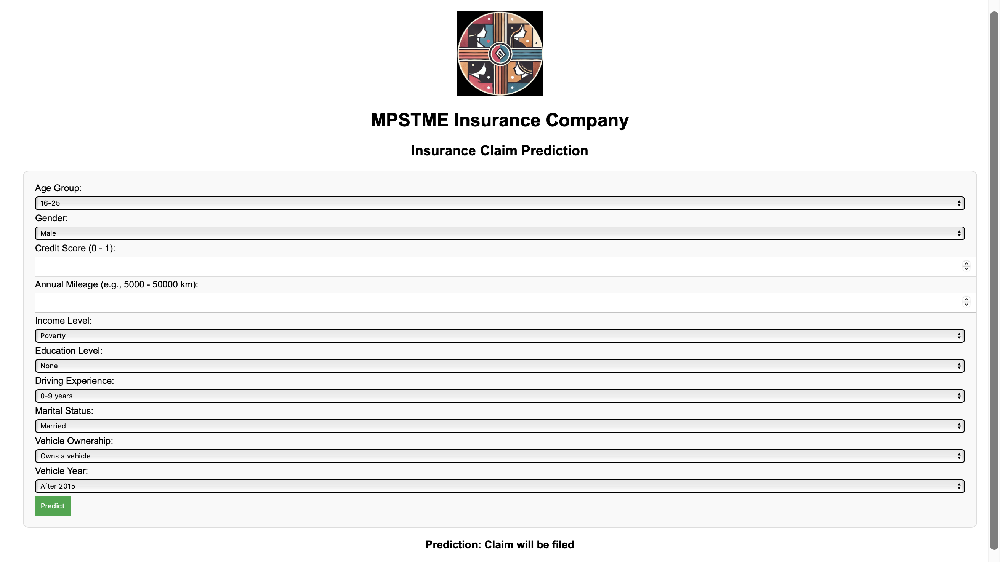

# 🚗 Car Insurance Claim Prediction

*A machine learning-based prediction model for insurance companies to assess the likelihood of a customer making an insurance claim.*

---

## 📌 Table of Contents
- [Overview](#overview)
- [Project Features](#project-features)
- [Dataset Description](#dataset-description)
- [Tech Stack](#tech-stack)
- [Project Structure](#project-structure)
- [UI Screenshots](#ui-screenshots)
- [Installation & Setup](#installation--setup)
- [Usage](#usage)
- [Model Performance](#model-performance)
- [Contributing](#contributing)
- [License](#license)
- [Contact](#contact)

---

## 📖 Overview
This project predicts whether a customer will file a car insurance claim based on various parameters such as driving history, vehicle details, and past claims. The model helps insurance companies optimize risk assessment and reduce fraudulent claims.

---

## ✨ Project Features
✔️ Predicts the likelihood of an insurance claim  
✔️ Uses **Machine Learning (ML) algorithms** for prediction  
✔️ Web interface to input customer data  
✔️ Visualizes key insights from data  
✔️ REST API for integrating with other systems  

---

## 📂 Dataset Description
The dataset contains customer information including:
- **Demographics:** Age, gender, marital status, etc.
- **Vehicle Details:** Type, model year, previous claims
- **Driving History:** Past violations, accident history

---

## 🛠️ Tech Stack
1️⃣ Programming Languages
Python 🐥 → Used for Machine Learning and Backend Development
HTML, CSS 🎨 → Used for Frontend UI in index.html

2️⃣ Backend Framework
Flask → Lightweight Python framework for API development

3️⃣ Machine Learning Libraries
Scikit-Learn (scikit_learn) → Model training & evaluation
Imbalanced-Learn (imbalanced_learn) → Handling imbalanced datasets (e.g., SMOTE)
NumPy → Numerical operations
Pandas → Data manipulation
SciPy → Advanced mathematical and statistical functions

4️⃣ Deployment & Containerization
Docker → Containerized deployment
Docker Compose → Service orchestration
AWS EC2 → Cloud deployment for hosting the API

5️⃣ Data Handling
Pickle → Model serialization (encoder.pkl, scaler.pkl, model.pkl)
CSV → Dataset storage (Car_Insurance_Claim.csv)

6️⃣ Version Control & CI/CD
Git & GitHub → Code management and collaboration
GitHub Actions (Optional) → Automated deployment pipeline

---

## 📂 Project Structure

---

## 📸 UI Screenshots
### 🔹 Homepage

### 🔹 No Claim Prediction Output

### 🔹 Claim Prediction Output

---

## ⚙️ Installation & Setup

Follow these steps to run the project locally:

1️⃣ Clone the Repository
git clone https://github.com/sruthy-sn91/car_insurance_claim_prediction.git
cd car_insurance-claim_prediction

2️⃣ Install Dependencies
pip install -r requirements.txt

3️⃣ Train the Model (If Needed)
python app/model.py

4️⃣ Run Flask Locally
python app/app.py

Visit http://127.0.0.1:5000/ in your browser.

🐳 Running with Docker

1️⃣ Build Docker Image
docker build -t insurance-claim .

2️⃣ Run Docker Container
docker run -d -p 5000:5000 -v $(pwd)/models:/app/models insurance-claim

3️⃣ Access the UI
Visit http://localhost:5000/ in your browser.

☁️ Deploying to AWS EC2

1️⃣ Launch an EC2 Instance
Select Ubuntu 22.04 LTS
Allow port 5000 in security groups

2️⃣ Connect to EC2
ssh -i your-key.pem ubuntu@your-ec2-public-ip

3️⃣ Install Docker & Git on EC2
sudo apt update -y
sudo apt install -y docker.io git
sudo systemctl start docker
sudo systemctl enable docker

4️⃣ Clone Repo & Run Docker on EC2
git clone https://github.com/sruthy-sn91/car_insurance_claim_prediction.git
cd car_insurance_claim_prediction
sudo docker build -t insurance-claim .
sudo docker run -d -p 5000:5000 -v $(pwd)/models:/app/models insurance-claim

5️⃣ Test the API on EC2
curl http://127.0.0.1:5000/

✅ If successful, open the API in a browser:
http://your-ec2-public-ip:5000/

## 🛠️ Usage

Launch the web app and enter customer details.
Click "Predict" to get claim probability.

## 📊 Model Performance

Accuracy: 88%

Precision: 87%

Recall: 89%

F1-score: 88%

ROC-AUC Score : 0.88

Algorithm Used: Random Forest

Multiple models such as Logistic Regression, Decision Tree, Random Forest, Gradient Boosting, SVM, Adaboost, XGBoost, KNN, Naive Bayes, and ANN were used and the best model was selected.
Model evaluation is available in the car_insurance_pred.ipynb Jupyter Notebook.

The explainability of the model was analysed using SHAP and LIME.

## 🤝 Contributing

Contributions are welcome! Follow these steps:

Fork the repo

Create a feature branch:
git checkout -b feature-name

Commit changes:
git commit -m "Added new feature"

Push to GitHub:
git push origin feature-name

Create a Pull Request (PR)

## 📬 Contact

📧 Email: sruthy.sn91@gmail.com

🔗 GitHub: [@sruthy-sn91](https://github.com/sruthy-sn91)

🔗 LinkedIn: [Profile](https://www.linkedin.com/in/sruthy-sreerag-nath/)

🔥 If you found this project helpful, don't forget to ⭐ the repository! 🚀
